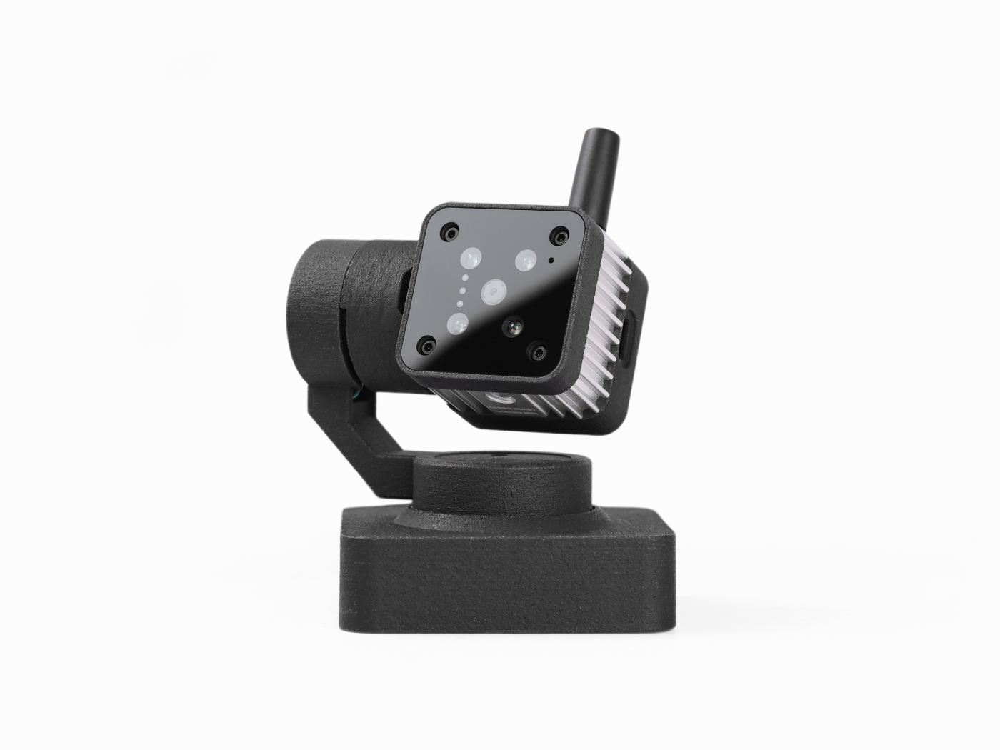

# reCamera Gimbal 2002w 硬件

[English](README.md) | 简体中文

Gimbal 是 reCamera 2002w 系列的运动云台形态。双无刷电机提供 360° 水平
旋转与 180° 俯仰，B401 底板通过 CAN 连接摄像头与电机系统。

| 项目 | 硬件 |
| --- | --- |
| 摄像头堆叠 | [C1-2002w](../../core/c1-2002/) + [S101 OV5647](../../sensors/s101-ov5647/) |
| 云台底板 | [B401 CAN](../../base/b401-can/) |
| 电机接口 | CAN；官方规格列出最高 1Mbps |
| 运动范围 | 水平 360°、俯仰 180° |
| 供电 | 12V DC 经专用电源板连接 XT30 |
| 机械源文件 | [STEP/3MF 文件](mechanical/) |
| 电源板源文件 | [KiCad 与原理图](power-board/PCB/) |

这里只保留硬件设计资料。电机工具、可执行文件、固件、Node-RED 流程和控制
示例不属于本仓库范围。

- [购买 reCamera Gimbal 2002w](https://www.seeedstudio.com/reCamera-Gimbal-2002w-64GB-p-6403.html)
- [官方硬件 Wiki](https://wiki.seeedstudio.com/recamera_gimbal_hardware_and_specs/)
