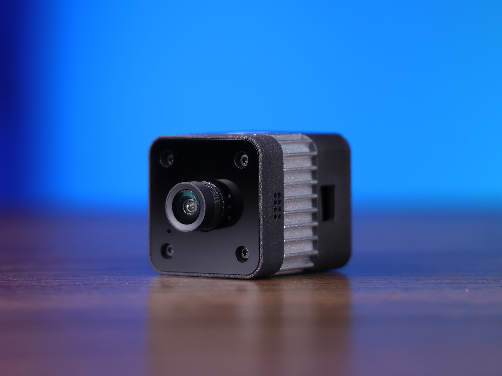

# reCamera 2002 HQ PoE hardware

English | [简体中文](README-CN.md)

HQ PoE is the network-oriented fixed-camera form of the reCamera 2002 family.
It combines the SG2002 core with the S401 GC2053 sensor
board and B301 PoE base.

| Item | Hardware |
| --- | --- |
| SoC / memory | SG2002, 256MB |
| Sensor | GC2053, 1/2.9-inch CMOS, 1920×1080 at 30fps |
| Lens | Replaceable M12; official default FOV approximately 90° |
| Base | [B301 PoE](../../base/b301-poe/) |
| Sensor board | [S401 GC2053](../../sensors/s401-gc2053/) |
| Network / power | 100Mbps Ethernet; 802.3af PoE Mode A |
| Expansion | UART, debug, and three GPIOs through the six-pin connector |

The commercial product page currently lists a 64GB configuration. Availability
and selected storage should always be verified on the storefront.

- [Buy reCamera 2002 HQ PoE](https://www.seeedstudio.com/reCamera-2002-HQ-PoE-64GB-p-6557.html)
- [Official hardware Wiki](https://wiki.seeedstudio.com/recamera_hq_poe_hardware_and_specs/)
