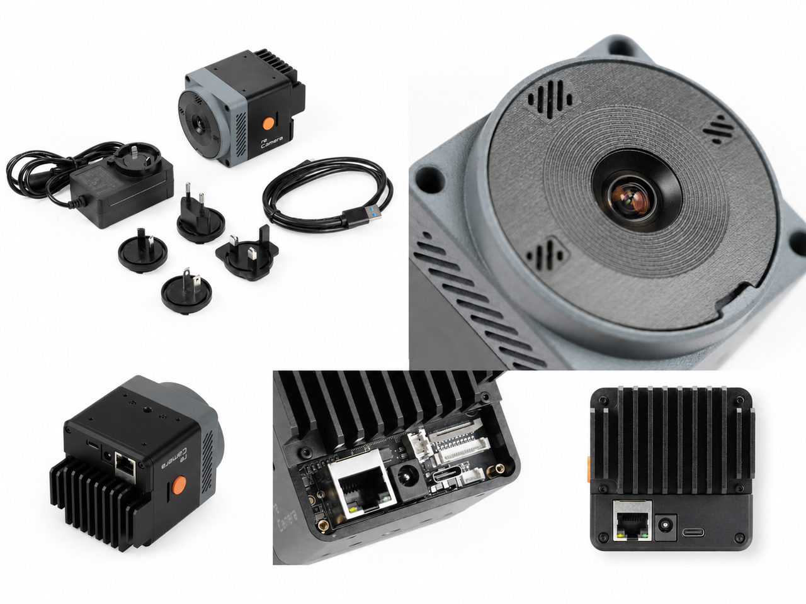
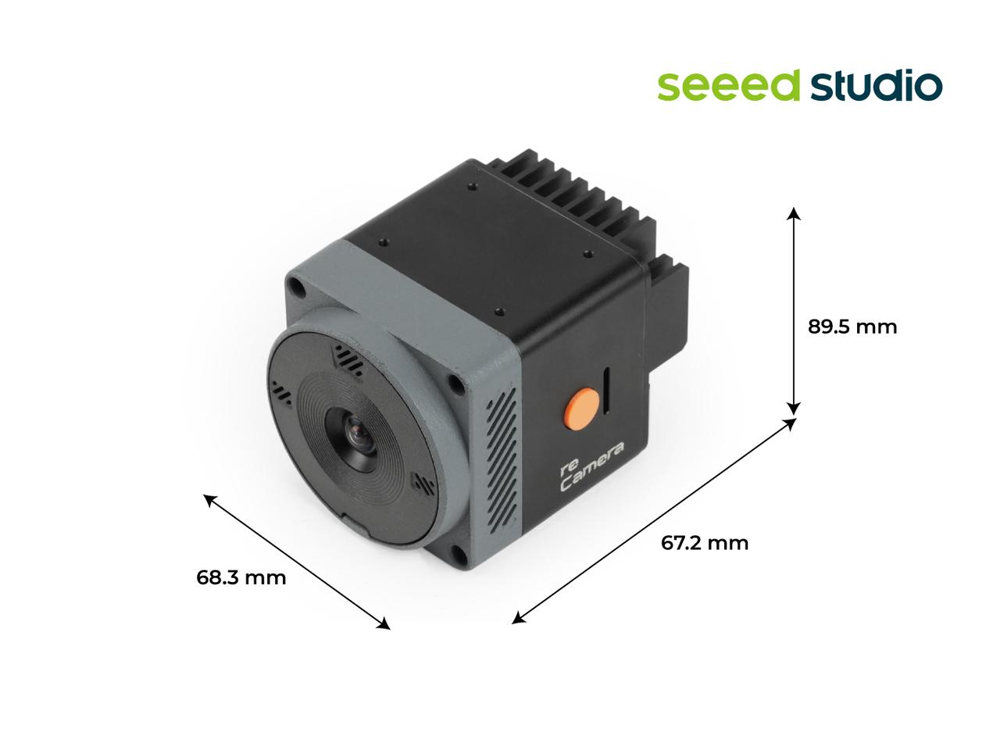
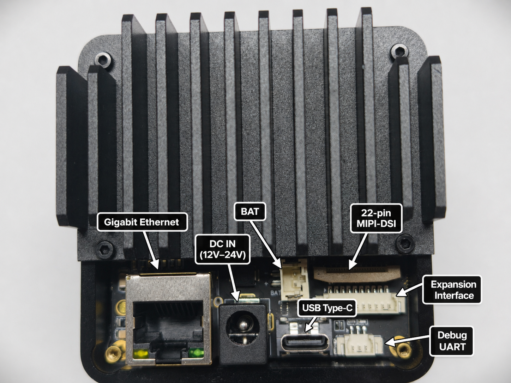
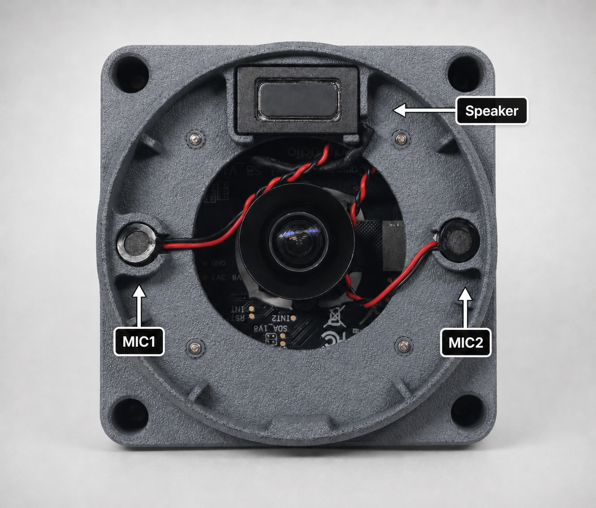
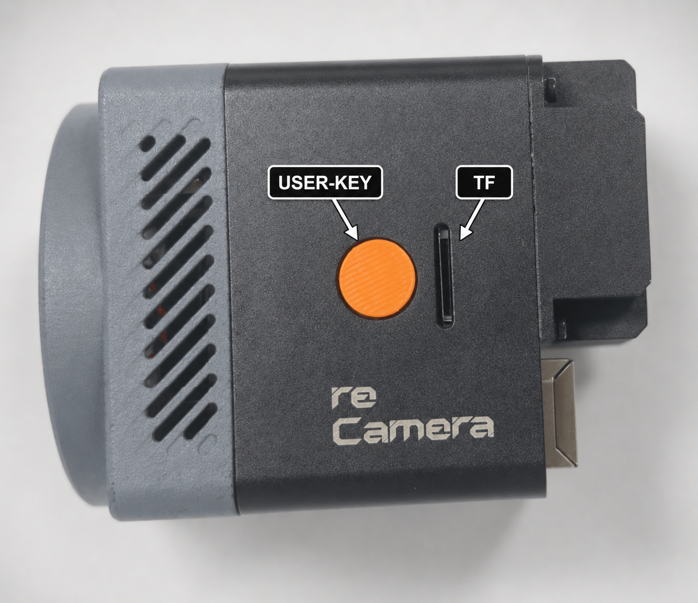
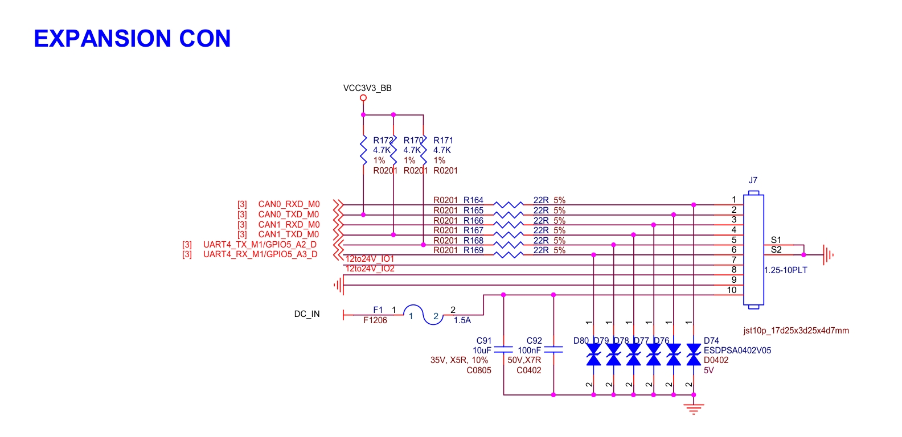
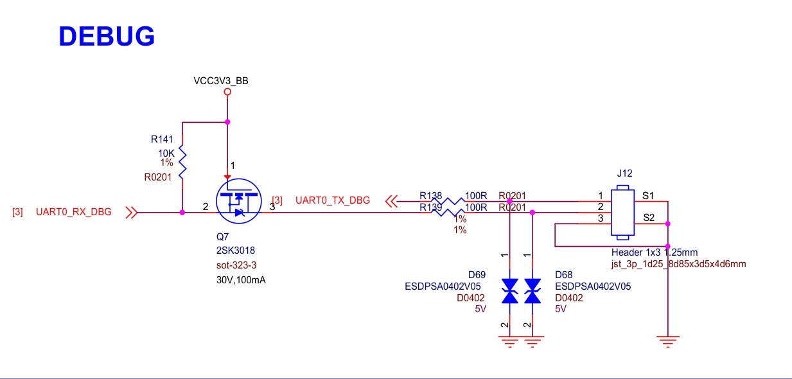

# reCamera Pro hardware

English | [简体中文](README-CN.md)

[Buy reCamera Pro 2GB from Seeed Studio](https://www.seeedstudio.com/reCamera-Pro-2GB.html)

reCamera Pro is the higher-performance integrated product family based on the
Rockchip RV1126B. Unlike the three-board modular architecture of the concurrently
sold reCamera 2002 family, Pro integrates sensing, audio, networking, power, and
expansion interfaces in one camera platform.

## Official hardware specifications

Reviewed against the Seeed Studio Wiki on **2026-08-11**.

| Item | Specification |
| --- | --- |
| Processor | Rockchip RV1126B |
| CPU | Quad-core Arm Cortex-A53 at 1.2GHz |
| NPU | 3 TOPS; mixed INT8/INT16 computation |
| Memory | 2GB / 4GB LPDDR4 |
| Storage | 16GB eMMC; microSD slot up to 512GB |
| Camera | 8MP SC850SL, up to 4K at 30fps |
| IMU | ICM-42670-P six-axis accelerometer and gyroscope |
| Audio input | Two electret microphones |
| Audio output | 8Ω speaker, rated 1W |
| Networking | Gigabit Ethernet, dual-band Wi-Fi, Bluetooth |
| Power | 12–24V DC through 5525 barrel jack; PoE; 7.4V lithium-battery charge/discharge management |
| USB | Full-function USB Type-C (OTG) |
| Expansion | Debug UART, CAN ×2, GPIO ×2, 22-pin MIPI DSI |

## Hardware views

### Product gallery

The following high-resolution images come from the official Seeed Studio
storefront and present the product, supplied hardware, and physical dimensions.

| Product and accessories | Physical dimensions |
| --- | --- |
|  |  |

### Interface overview

### Front and side

| Front | Side |
| --- | --- |
|  |  |

### Expansion connector and debug UART

| Expansion connector | Debug UART |
| --- | --- |
|  |  |

## Design-source status

This directory does not currently claim to provide the editable PCB, BOM, or
mechanical source set for reCamera Pro. Promotional images come from the official
storefront, interface images come from official documentation, and the table is
a dated specification snapshot. Add
manufacturing sources only after the correct hardware revision is approved for
public release.

## Official references

- [Product and ordering page](https://www.seeedstudio.com/reCamera-Pro-2GB.html)
- [Hardware specifications](https://wiki.seeedstudio.com/recamera_pro_hardware_specifications/)
- [Quick start and physical connection](https://wiki.seeedstudio.com/recamera_pro_getting_started/)
- [Chinese hardware specifications](https://wiki.seeedstudio.com/cn/recamera_pro_hardware_specifications/)
