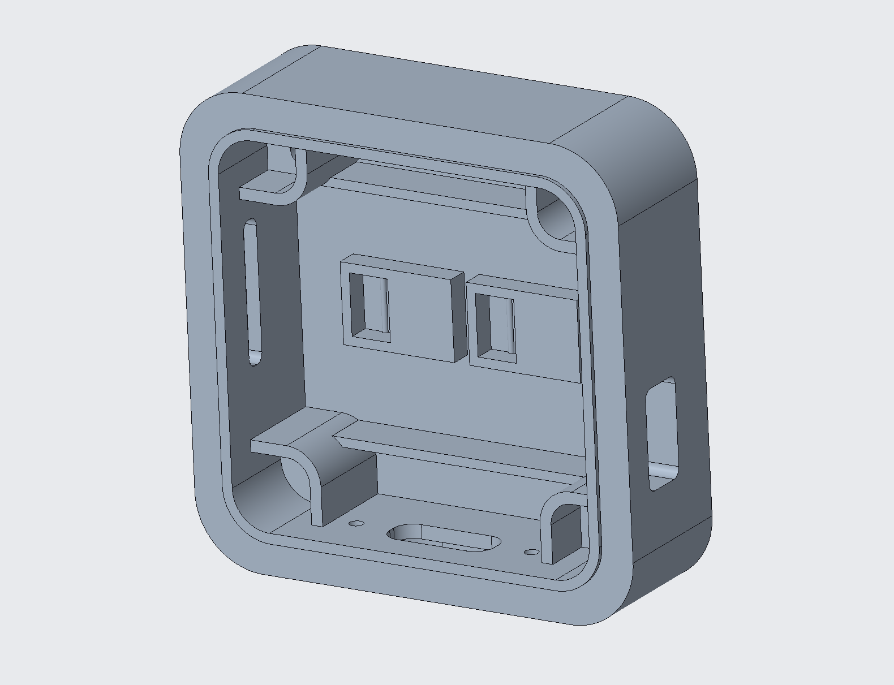

## B1_Default
🎈🎈🎈🎈🎈🎈🎈🎈🎈

**The project contains the 3D housing and circuit design files of the cover board.**

You can use this project to make your own PCB, and the design drawing can also be used as a basic reference for your design.

### ⚙️ schematic

