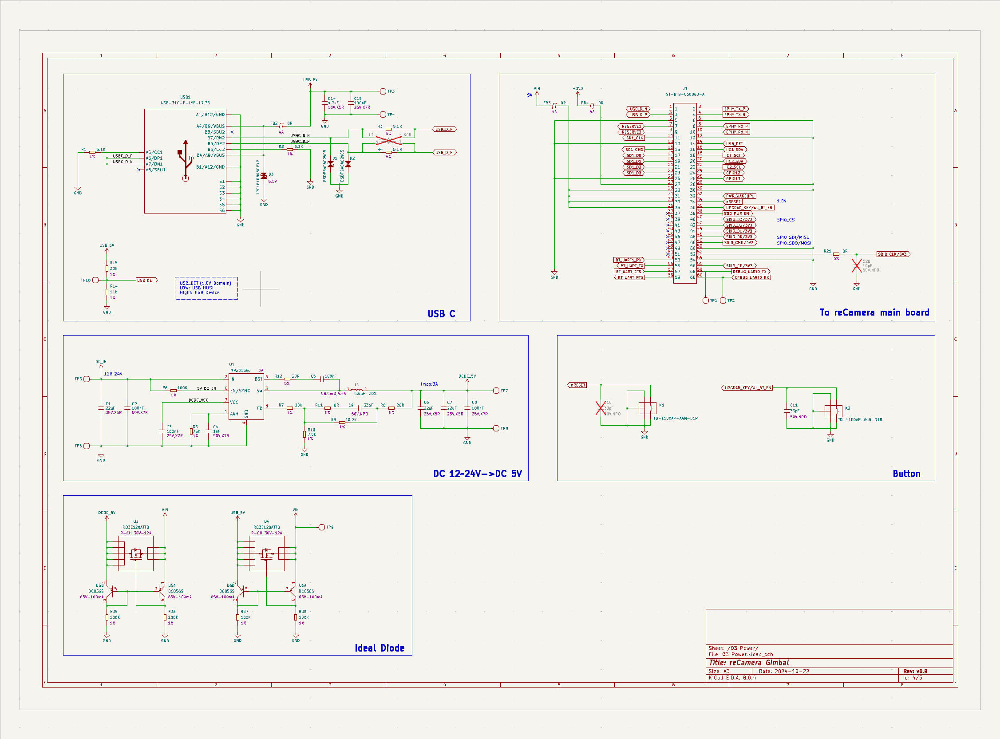
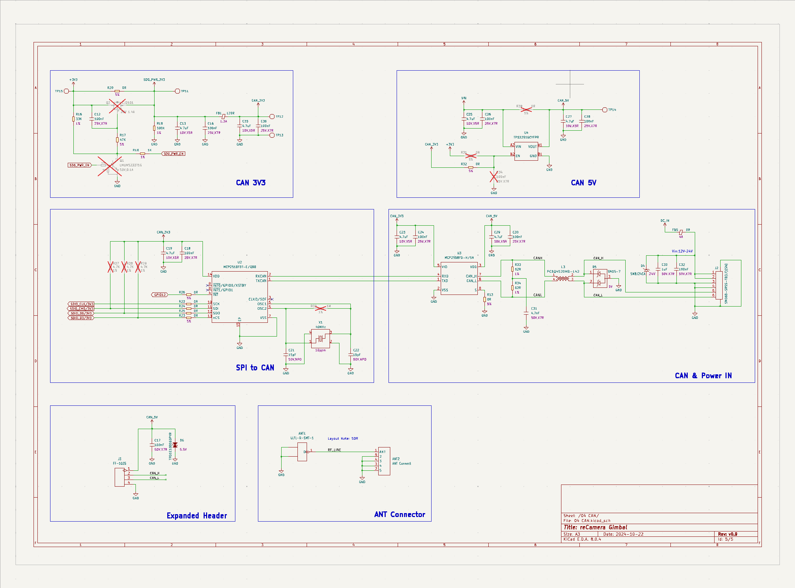
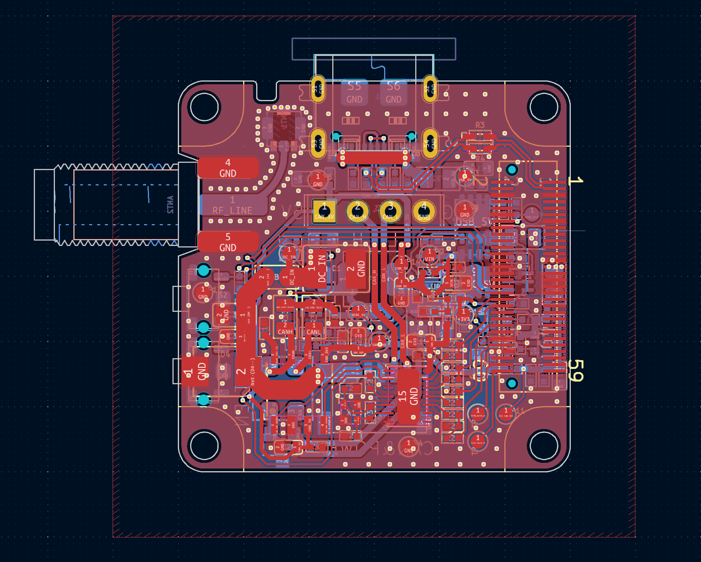

## Introduction
> The design is only for reference, commercial application or project deployment, please improve the design. This project is a Demo test version. The PCB has not been rigorously tested, so please use it with caution. Later [Seeed mall](https://www.seeedstudio.com/reCamera-2002w-8GB-p-6250.html) will be on the shelf of the circuit board. 

This board is designed for reCamera Gimbal.

### ⚙️ schematic

### ⚙️ PCB

