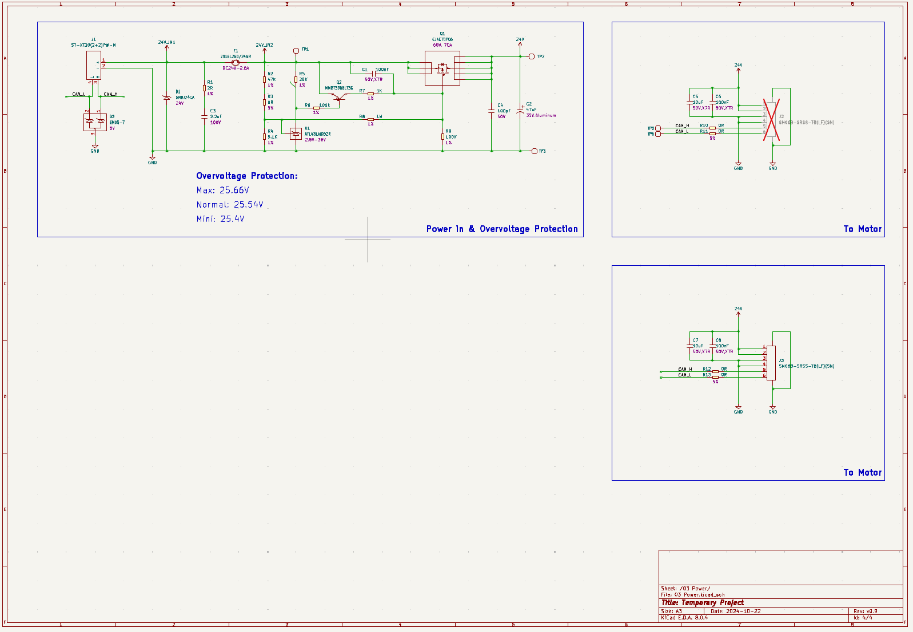
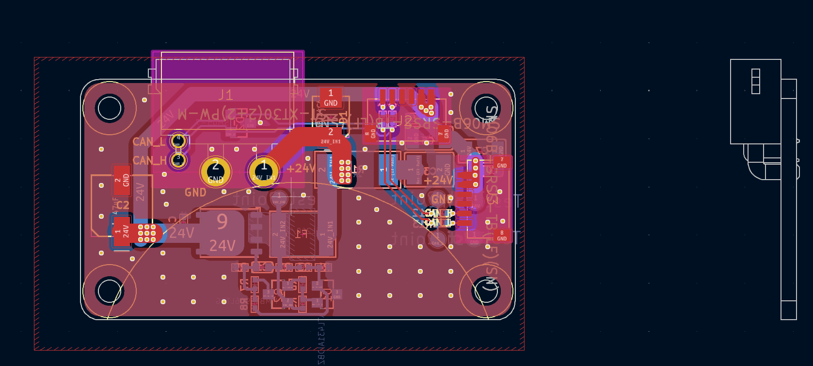

## Introduction

This board is designed for reCamera Gimbal.
It provides power for the entire Gimbal unit, and it is important to note that only a 12V power supply can be connected.

### ⚙️ schematic

### ⚙️ PCB

