# reCamera Gimbal Programmable Development Kit V1.1🎨

## 🔥Introduction

Welcome to reCamera Gimbal Programmable Development Kit V1.1. We provide sample code to debug the gimbal motor's operation and status output. We offer program entry points to drive the gimbal motor using CAN, enabling precise control and functionality.


## Gimbal STL

You can [download the STP file](./Model) of this gimbal for 3D printing and assemble it. 

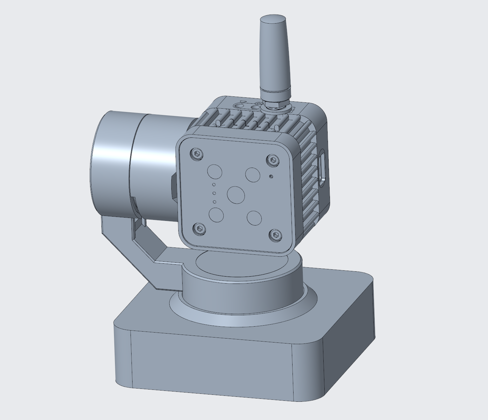

| Preview | Models |
| ------- | ------ |
| 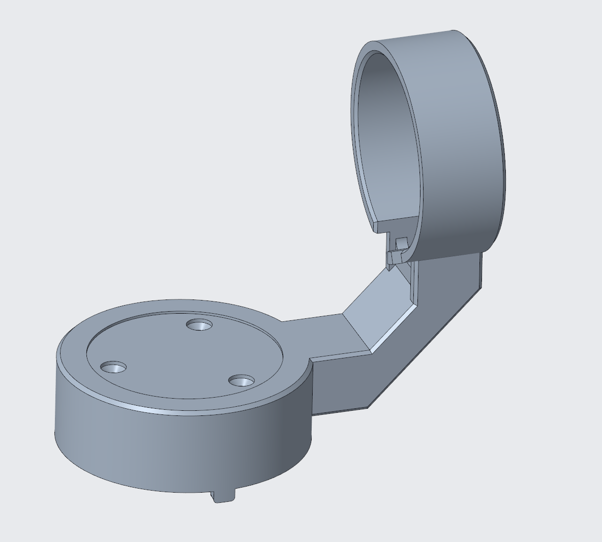        | [Download](./Model/recamera-yantai_arm_30.stp)       |
| 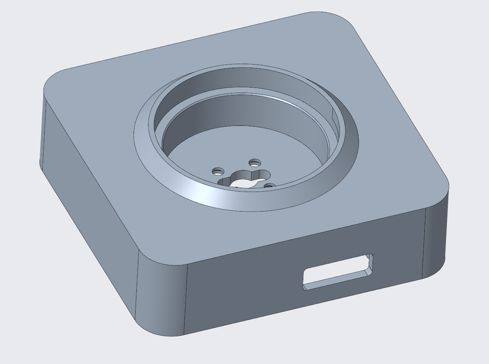   | [Download](./Model/platform-box_29.stp)              |
| 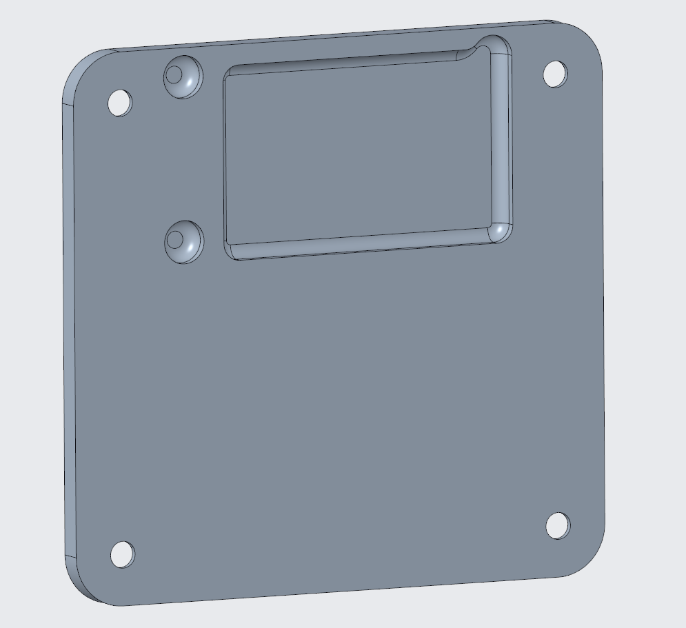   | [Download](./Model/bottom-plate_10.stp)              |
|    | [Download](./Model/brushlessmotor-ms3506_4.stp)      |
| 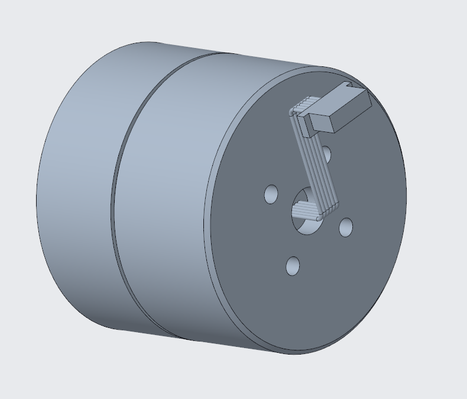   | [Download](./Model/brushlessmotor-ms3008v2_2.stp)    |
| 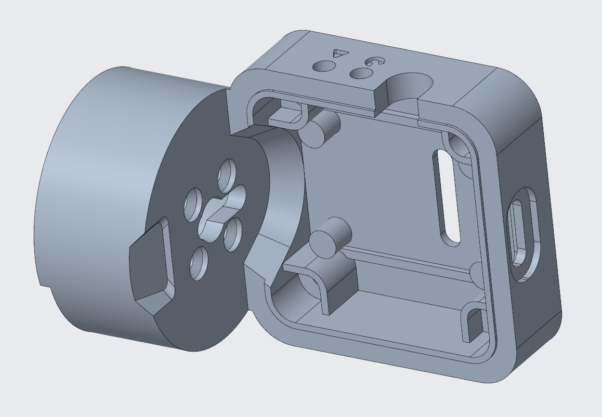   | [Download](./Model/recamera-gimbalcover-4040_20.stp) |
|    | [Download](./Model/can-case_3.stp)                   |
|    | [Download](./Model/recamera-middleframe-4040-1_27.stp)|
| 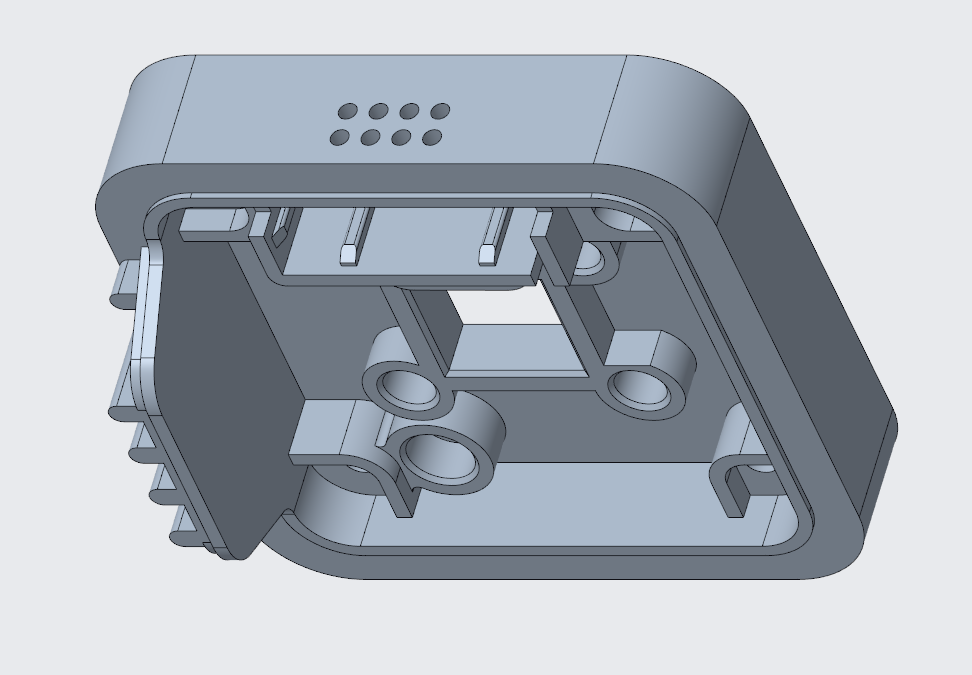   | [Download](./Model/recamera-sensorcover-4040-1_36.stp)|
| 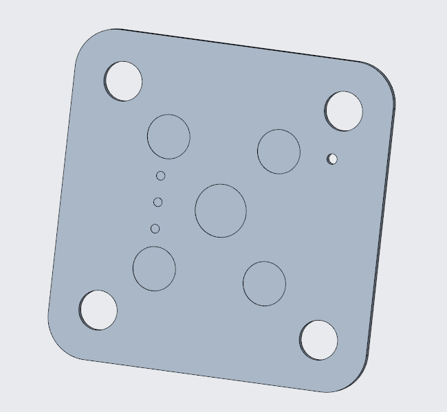   | [Download](./Model/glass-4040_6.stp)                 |


## Instructions for using

### Motor ID Set

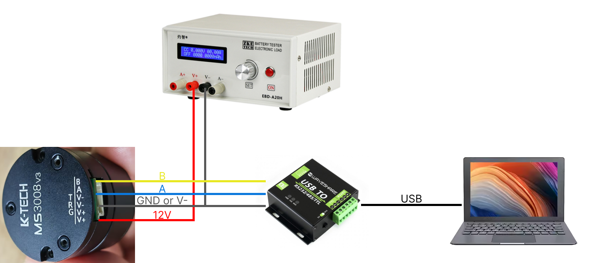

ID changes can be made using MS_Motor/LK motor tool V2.35.exe. Connect the PC (Windows) to the USB-RS485 module, with A, B, and GND of the USB-RS485 module connected to A, B, and V- of the motor. Connect the positive and negative terminals of a 12V power supply to V+ and V- of the motor to enable parameter changes. For further instructions on using LK motor tool V2.35.exe, refer to MS_Motor/Upper_monitor_motor_debuging_instruction.pdf. 

Only two motors are used in this head, so it is sufficient to set the IDs of the two motors to 01 and 02 respectively.

### USB-RS485 Analyzer

If you want a RS485 Bus Analyzer to debug your RS485 Bus, this [USB-RS485 Analyzer](https://www.seeedstudio.com/USB-TO-RS232--RS485--TTL-Industrial-Isolated-Converter-p-3231.html) is recommended.

<p float="left">
  
</p>


## Hardware Overview

To enable the reCamera to drive the gimbal motor, the reCamera's base board needs to be replaced to [B4_Gyro](https://github.com/Seeed-Studio/OSHW-reCamera-Series) to enable CAN communication.


You can use the Debugging Port connections to control the motor and communicate with the reCamera via the upper monitor. Alternatively, you can control the motor directly through the reCamera.

## Deploy in reCamera

It is recommended to use **Ubuntu 20.04** to configure this gimbal, as it will be needed for the cross-compilation part. If you don't have Ubuntu 20.04, you can configure [**TinyCC**](https://community.milkv.io/t/tinycc-milkv-duo-c/271) on reCamera.


### Cross-Compilation

Open a terminal in any directory on your Ubuntu system.

```
sudo apt install vim
git clone https://github.com/sophgo/host-tools.git
```

After the download is complete go to the file "/host-tools/gcc/riscv64-linux-musl-x86_64/bin"

<p float="left">
  
</p>

Enter "pwd" to see the absolute path and copy it.

```
pwd
```

<p float="left">
  
</p>

```
cd
vim .bashrc
```

<p float="left">
  
</p>

Based on the previous “pwd” command, add the following to the end of the file 

```
export PATH=$PATH:/home/kong/Downloads/host-tools/gcc/riscv64-linux-musl-x86_64/bin
```

Click esc and type “:wq” to save the .bashrc.

```
source .bashrc
```

Go back to the Seeed_reCamera_Gimbal directory. Compile Deploy_Linux_CAN_Final.c and run it.

```
riscv64-unknown-linux-musl-gcc -o Deploy Deploy_Linux_CAN_Final.c
```

Open a terminal in the directory where Deploy is stored.

```
scp ./Deploy root@192.168.42.1:~/
```

```
ssh root@192.168.42.1
```


```
./Deploy <degree1> <degree2>

Example: ./Deploy 0 0
```


### TinyCC Compilation

Open a terminal in the directory where Deploy_Linux.c is stored.

```
cd ./reCamera_Deploy
scp ./Deploy_Linux_CAN_Final.c root@192.168.42.1:~/
```

```
ssh root@192.168.42.1
```

The serial port name can be obtained by terminal. It is usually ttyS0.

```
ls /dev/ttyS*
```

Open Deploy_Linux_CAN_Final.c and change the serial port name on line 160. 

```
vi ./Deploy_Linux_CAN_Final.c
```

<p float="left">
  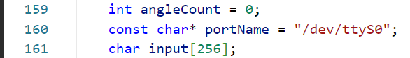
</p>

Compile Deploy_Linux_CAN_Final and run it.

```
cd ~/
tcc -o test Deploy_Linux.c
./test
```


<p float="left">
  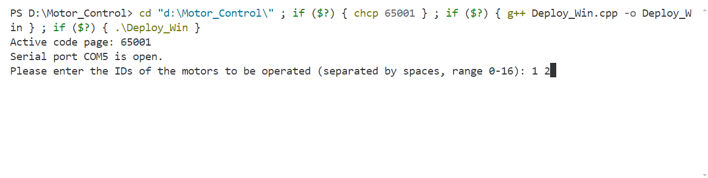
  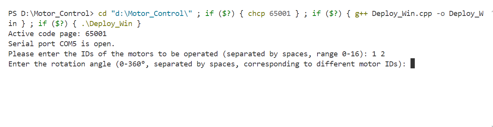
</p>


## Deploy to Upper Monitor


### Upper Monitor Control

#### Python

Open a terminal in the root directory while making sure Python is installed.

```
python Deploy_Python.py
```

Then just enter the angle (0-360 degrees) for both motors.

<p float="left">
  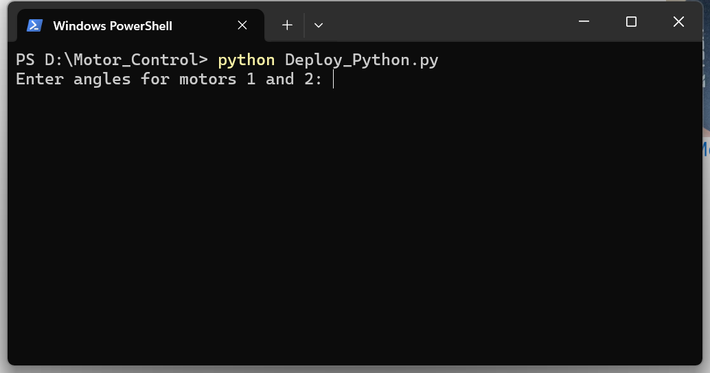
</p>

#### C++

Make sure your system ([Win](https://cloud.tencent.com/developer/article/1500352) or Linux) has g++ installed, open a terminal in the root directory.

*Win*

Open Deploy_Win.cpp and change the serial port name on line 125. The serial port name can be obtained by opening the Device Manager.

```
g++ Deploy_Win.cpp -o Deploy_Win.exe
```

*Linux*

Open Deploy_Linux.cpp and change the serial port name on line 160. The serial port name can be obtained by terminal.

```
ls /dev/ttyUSB*
```

```
g++ Deploy_Linux.cpp -o Deploy_Linux
./Deploy_Linux
```

<p float="left">
  
  
</p>


----

