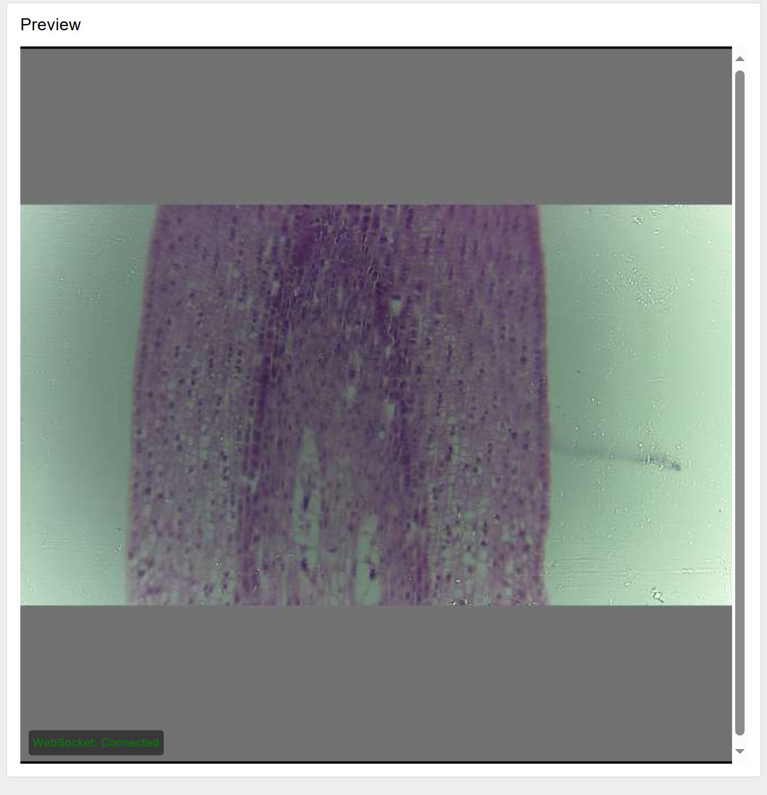
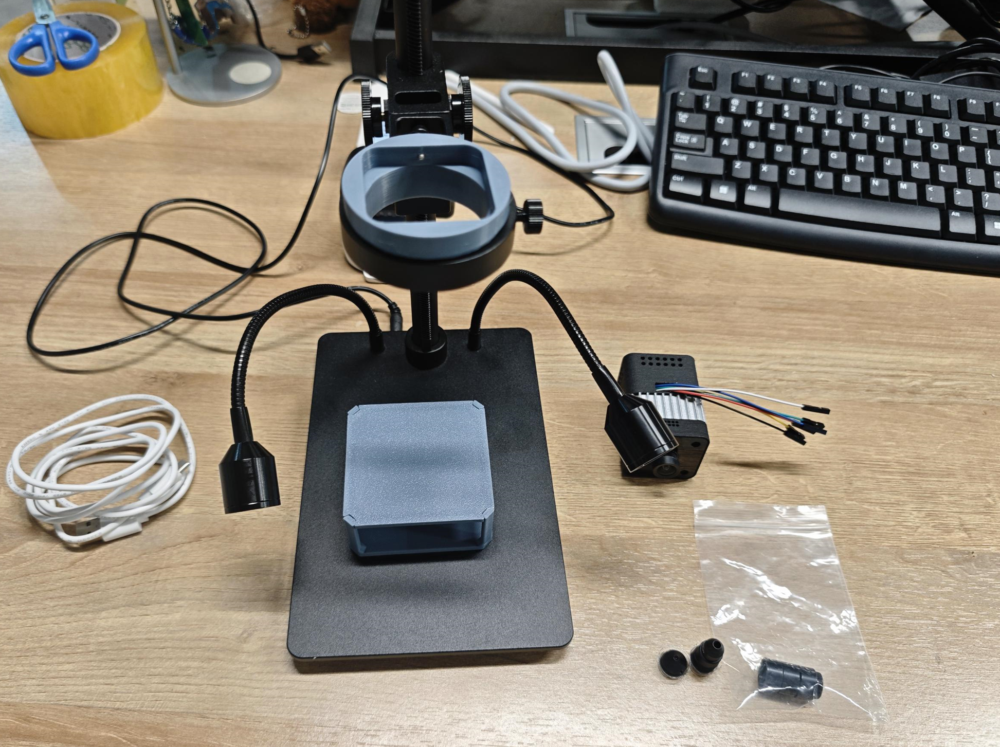
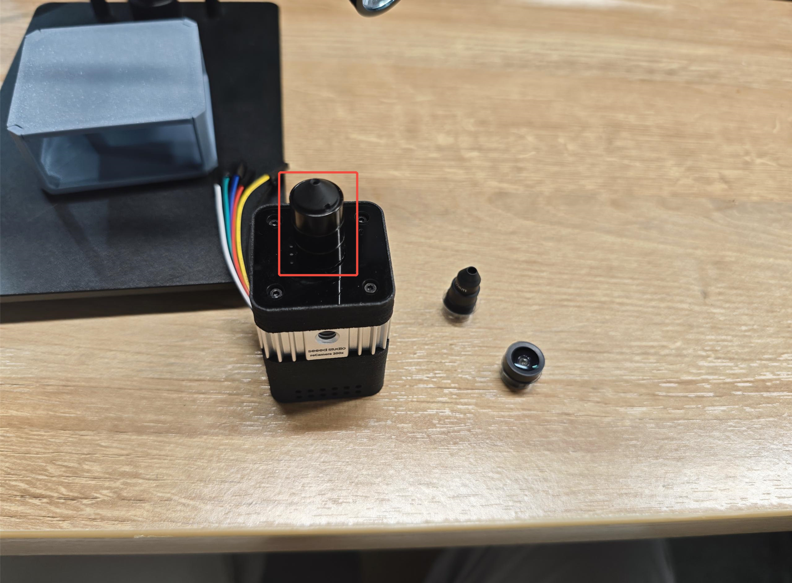
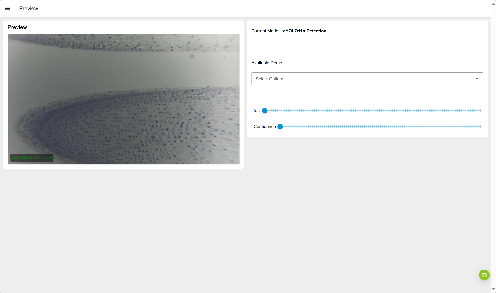

# reCamera_Microscope

## 🔥What is reCamera_Microscope?

reCamera_Microscope is an open-source project based on the [reCamera 2002 series](https://www.seeedstudio.com/reCamera-2002w-64GB-p-6249.html) and [GC2053 Sensor Board](https://www.seeedstudio.com/reCamera-2002-Sensor-Board-GC2053-p-6556.html). You can also use the [reCamera 2002 HQ PoE version](https://www.seeedstudio.com/reCamera-2002-HQ-PoE-64GB-p-6557.html) to complete this project.

## 💡What can the reCamera_Microscope be used for?

What Can reCamera_Microscope Be Used For? 
reCamera_Microscope supports switching lenses with different magnification levels, enabling it to capture images of subjects such as PCBs (Printed Circuit Boards), electronic components, cells, insects, and plant samples. 
The reCamera Sg2002 series comes with a built-in computing power of 1 TOPS, allowing it to run the YoloV11 model. When combined with object detection or segmentation models, it can be applied to scenarios including PCB defect detection, electronic component classification, as well as the classification and counting of cells, insects, and plant samples. 
More application directions are yet to be explored by all of you.

## 📷Preview 

## 🔧Hardware Composition of reCamera_Microscope

1. reCamera POE
2. 3D Printer x2
3. M12 lens x2
4. M12 Lens Extension Bracket x3
5. microscope holder
6. 12V power adapter
7. Type-C cable

## 🛒Purchase Links

| reCamera POE & Type-C cable                | [reCamera 2002 HQ PoE 8GB](https://www.seeedstudio.com/reCamera-2002-HQ-PoE-8GB-p-6558.html) |
| ------------------------------------------ | ------------------------------------------------------------ |
| 3D Printer x2                              |                [3D Printer Download](./3D_Printed_Case/top_2.3mf)                                              |
| M12 lens x2                                | [6mmB款，生物显微镜-淘宝网](https://item.taobao.com/item.htm?id=966337796751&mi_id=0000aLtG3Un2BtLBwdSYZFPZI-nRQdgezdGbA6si_qz_3TY&spm=tbpc.boughtlist.suborder_itemtitle.1.55272e8dr0BSO6&sku_properties=1627207%3A1364564910) [22mmB款，PCB显微镜-淘宝网](https://item.taobao.com/item.htm?id=966337796751&mi_id=0000aLtG3Un2BtLBwdSYZFPZI-nRQdgezdGbA6si_qz_3TY&sku_properties=1627207%3A1392136713&spm=tbpc.boughtlist.suborder_itemtitle.1.55272e8dr0BSO6) |
| M12 Lens Extension Bracket x3              | [买2送1 M12*0.5接口增距环-淘宝网](https://item.taobao.com/item.htm?id=727001812366&mi_id=0000GVjgJwtQrpMV3hfTIBkQ7C750g4UcKWmn7jTQMZm4Kk&spm=tbpc.boughtlist.suborder_itemtitle.1.442e2e8d4bcrJz) |
| microscope holder & 12V power adapter | [海约便携式电子显微镜升降支架自带光源35/50mm小底座维修工作台-淘宝网](https://item.taobao.com/item.htm?id=749452322341&mi_id=0000hBbQQwAlptuyVy-eEdVQVGl4eia1yeh5B2o2U_KOHoQ&spm=tbpc.boughtlist.suborder_itemtitle.1.55272e8dr0BSO6) |

## Installation Steps

**As shown in the figure, assemble the bracket, connect it to the 12V power supply, and install the 3D printed part.**

As shown in the figure, the microscope kit contains two lenses. You need to remove the wide-angle lens and replace it with the other two lenses.

### 🎨Option1: Lens 1: Use of the microscope lens

As shown in the figure, remove the microscope lens, install three lens extension adapters, and then install lens 1.

As shown in the figure, **connect the computer using a USB cable.**

 Visit `192.168.42.1` to view the loading page for reCamera. The logged-in **user** is: `root` ; the **password** is: `recamera.1`

You can purchase sample slices of plants, animals, or microorganisms and place them on the microscope stage. By adjusting the positions of the camera and the object, you will be able to see images of the microscopic world.

### 🎨Option2: Lens 2: Use PCB micro-lens

As shown in the figure, remove the microscope lens, install one lens extension adapter, and then install lens 2.

As shown in the figure, **connect the computer using a USB cable.**

 Visit `192.168.42.1` to view the loading page for reCamera. The logged-in **user** is: `root` ; the **password** is: `recamera.1`

There are two pre-trained models available here, which can be used to identify electronic components on PCBs or detect defects in PCBs.

| [PCB Electronic Component Detection Model](/yolo11n_models/PCB_Electronic/readme.md) | [Download](/yolo11n_models/PCB_Electronic/yolo11n_electronic.cvimodel)     |
| ---------------------------------------- | ------------ |
| [**PCB Defect Detection Model**](/yolo11n_models/PCB_Defect_Detection/readme.md)          | [**Download**](/yolo11n_models/PCB_Defect_Detection/yolo11n_PCB_Defect.cvimodel) |

