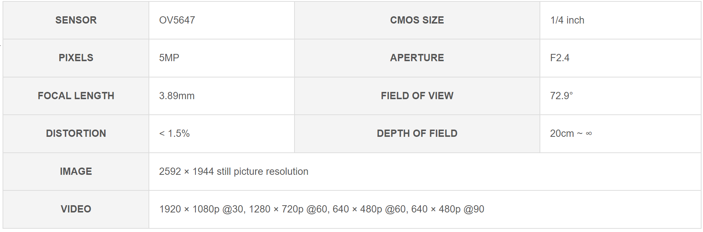

# Introduction

## reCamera Core

reCamera Core is a core module design based on SG2002 open source chip.
SG2002 equipped with high-performance RISC-V and ARM cores, it provides a fully open-source, ecosystem-rich deep learning vision processor that delivers 1.0 TOPS computing power@INT8.
s

As the name suggests, this is an open source camera core board. The core board contains the core processor, EMMC storage, and WiFi chip. The core module led all the pins of the processor out through two BtoB sockets.
Through this interface, junior electronics engineers can customize their exclusive cameras by designing SensorBoard and BaseBoard.

## Application:

### [reCamera Gimbal](./reCamera_Gimbal/readme.md)

Open source Gimbal solution made using reCamera.

### [reCamera Robot Arm](./reCamera_Robot_Arm/readme.md)

waiting...

## SensorBoard

### S1_OV5647

> overview
> 

>schematic

> features:

- sensor

- 4 x LED fill lights
- 1 x microphone
- 1 x speaker
- 3 x LED indicator

## BaseBoard
### B1_Default

### B2_POE

## Related Porjects:
