# Introduction

<a href="url">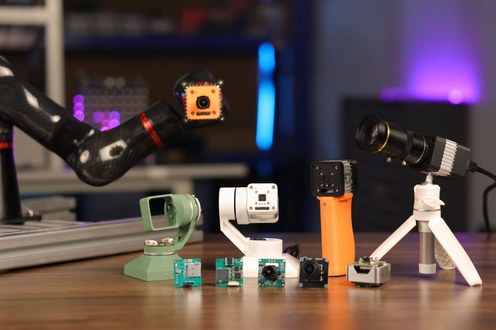</a>

 
&nbsp;
&nbsp;
&nbsp;
&nbsp;
&nbsp;

 

----

## Table of Contents

- [✨ What's reCamera?](#-whats-recamera)
- [🔖 Product Series](#-product-series)
- [🚀 Launch Notification--reCamera Gimbal](#-launch-notification--recamera-gimbal)
- [⚙️ Hardware Overview](#%EF%B8%8F-hardware-overview)
- [Core Board](#core-board)
- [Sensor Board](#sensor-board)
- [Base Board](#base-board)
- [reCamera Softwares](#recamera-softwares)
- [Related Projects](#related-projects)
- [Application Demo](#-application-demo)
- [reCamera Roadmap](#recamera-roadmap)
  

## ✨ What's reCamera? 

<a href="url">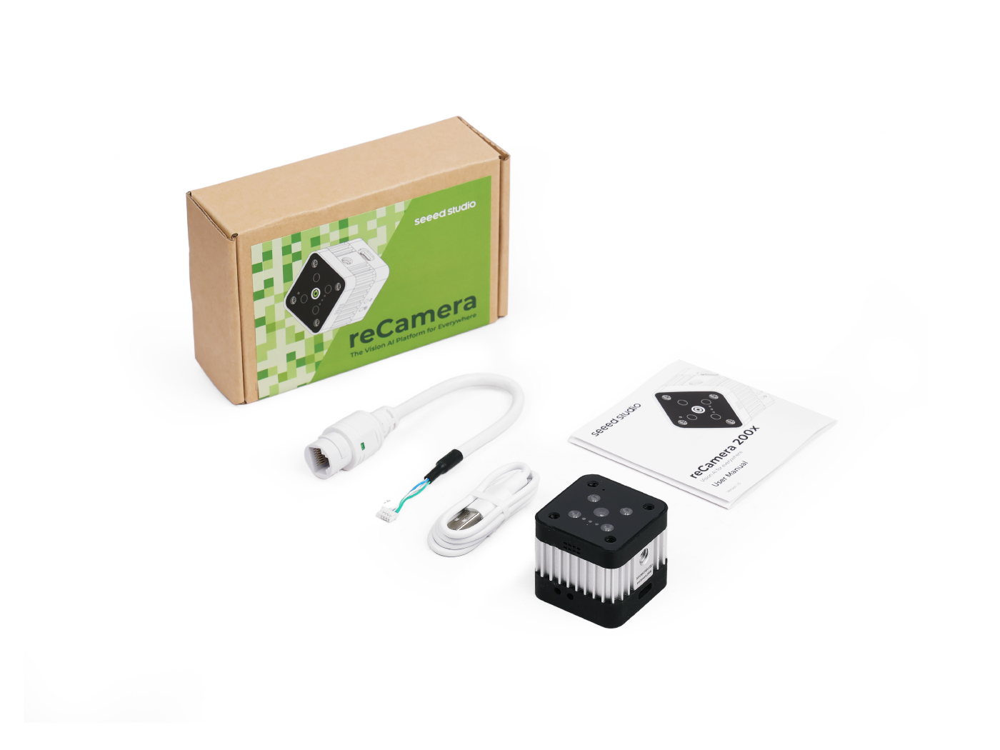</a>

reCamera is a combination of a **processor** and a **camera sensor**.

This combination makes reCamera a standalone system that can handle basic detection and control tasks on its own.

The first reCamera series - reCamera SG2002 is an open-source and tiny size AI camera, programmable and customizable, powered by an RISC-V SoC, delivering on-device 1 TOPS AI performance with video encoding 5MP @30 FPS. The modular hardware design and expandable interfaces offers the most versatile platform for developers building vision AI systems. 

## 🔖 Product Series

<table border="1">
    <tr>
        <th> </th>
        <th>reCamera Gimbal 2002w 8GB</th>
        <th>reCamera Gimbal 2002w 64GB</th>
        <th>reCamera 2002 8GB</th>
        <th>reCamera 2002 64GB</th>
        <th>reCamera 2002w 8GB</th>
        <th>reCamera 2002w 64GB</th>
    </tr>
    <tr>
        <td>Core Board</td>
        <td>Core 2002w 8GB</td>
        <td>Core 2002w 64GB</td>
        <td>Core 2002 8GB</td>
        <td>Core 2002 64GB</td>
        <td>Core 2002w 8GB</td>
        <td>Core 2002w 64GB</td>
    </tr>
    <tr>
        <td>Sensor Board</td>
        <td>S101(OV5647)</td>
        <td>S101(OV5647)</td>
        <td>S101(OV5647)</td>
        <td>S101(OV5647)</td>
        <td>S101(OV5647)</td>
        <td>S101(OV5647)</td>
    </tr>
    <tr>
        <td>Base Board</td>
        <td>B401</td>
        <td>B401</td>
        <td>B101</td>
        <td>B101</td>
        <td>B101</td>
        <td>B101</td>
    </tr>
    <tr>
        <td>Wireless (Wi - Fi/BT)</td>
        <td>✅</td>
        <td>✅</td>
        <td> </td>
        <td> </td>
        <td>✅</td>
        <td>✅</td>
    </tr>
    <tr>
        <td>Mounting Method</td>
        <td>Vertical</td>
        <td>Vertical</td>
        <td>Magnetic/Camera Bracket Mount</td>
        <td>Magnetic/Camera Bracket Mount</td>
        <td>Magnetic/Camera Bracket Mount</td>
        <td>Magnetic/Camera Bracket Mount</td>
    </tr>
    <tr>
        <td>Power Supply</td>
        <td>DC Jack cable/XT30(2+2)</td>
        <td>DC Jack cable/XT30(2+2)</td>
        <td>Type - C cable</td>
        <td>Type - C cable</td>
        <td>Type - C cable</td>
        <td>Type - C cable</td>
    </tr>
</table>

## 💡 Why we make reCamera? 

Today, as processors (both SOC and MCU) are becoming smaller and more powerful, it is now possible to combine the processor with camera sensors. In fact, many IPCs (IP cameras) are already using this design to accelerate AI detection on edge devices.

So today, we introduce reCamera, an open-source camera platform for everyone to play with. We have divided this project into 3 interchangeable parts:

<a href="url">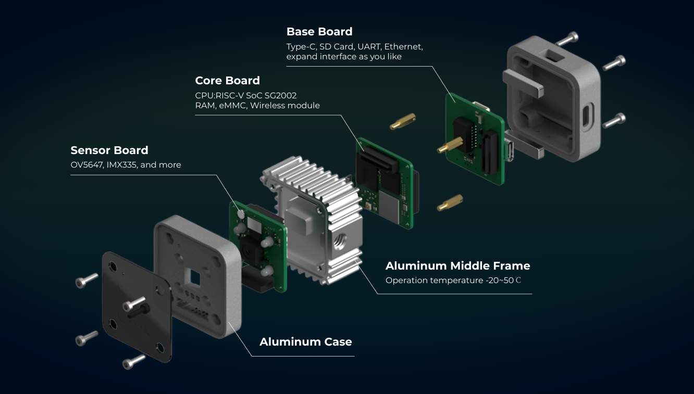</a>

- Core Board
- Sensor Board
- Base Board

This design allows you to easily change the interfaces and camera sensors to suit your needs. We hope that these components can be freely combined in any way.

By building this hardware platform and ecosystem, we enable other applications to grow on this platform without the need to worry about changing from one platform to another in the future.

The engineering focus on modularity, high performance, and ease of use ensures that reCamera serves as a powerful platform for developers and makers. This design streamlines complex hardware processes, allowing users to integrate vision AI capabilities into their systems efficiently and creatively. 

We've taken care of the intricate hardware work, freeing up time for user innovation. The modular design enables users to rapidly switch cameras and customize interfaces, transforming development from months to weeks only!

### 🚀 Launch Notification--reCamera Gimbal

We are excited to announce that the reCamera Gimbal will be released at the end of February! Stay tuned and follow the [Seeed Studio official website](https://www.seeedstudio.com/) for the latest updates.

The reCamera gimbal 2002 series is the first open-source camera control system, composed of one tiny AI camera - reCamera 2002w 8GB/64GB, and one compatible 2-Axis gimbal basement with 2 brushless motors. It is powered by an RISC-V SoC, providing 1 TOPS AI performance with video encoding at 5MP @ 30 FPS. It offers a Lego-like self-assembly package and integrates the Sensecraft AI platform and Node-RED platform for smooth graphical programming and pipeline construction, enabling rapid self-training, model conversion, and deployment of AI models such as Yolo v5/v8/11.

For more information, please visit [reCamera Gimbal](reCamera_Gimbal/readme.md) and [User manual](reCamera_Gimbal/static/reCamera_Gimbal_User_manual_V1.0.pdf).

----

## ⚙️ Hardware Overview

### Core Board

💡 Here is the [introduction](./reCamera_Core_Board/C1_2002/C1_Readme.md) of reCamera SG2002 series. So far we launched reCamera SG2002, [Click to have one](https://www.seeedstudio.com/recamera)!

| Board         | Features                           | Version |
| ------------- | ---------------------------------- | ------------ |
| [C1_2002w](./reCamera_Core_Board/C1_2002/)    | - eMMC   - WiFi/BLE module   - Onboard antenna   - External antenna connector| 1.2 |
| [C1_2002](./reCamera_Core_Board/C1_2002/)       | - eMMC   - Extra SDIO to base board   - Extra UART to base board | 1.2 |

  
Top View             |  Bottom View
:-------------------------:|:-------------------------:
  |  

### Sensor Board

💡 [Sensor Driver Support List](./Sensor_Supported_List.md) for Core Board C1 is provided for reference.

| Board         | Features                           | Latest Version                                                   |
| ------------- | ---------------------------------- | ------------------------------------------------------------ |
| [S1_OV5647](./reCamera_Sensor_Board/S1_OV5647/S1_Readme.md) | - 5MP    - Rolling Shutter | 1.2 |
| [S2_IMX335](./reCamera_Sensor_Board/S2_IMX335/)     | - 5MP    - Rolling Shutter | 1.0 |
| [S3_SC130GS](./reCamera_Sensor_Board/S3_SC130GS/)    | - 1MP   - Global Shutter    | 1.0 |

#### 💡 [S1_OV5647](./reCamera_Sensor_Board/S1_OV5647/S1_Readme.md)

Top View             |  Bottom View
:-------------------------:|:-------------------------:
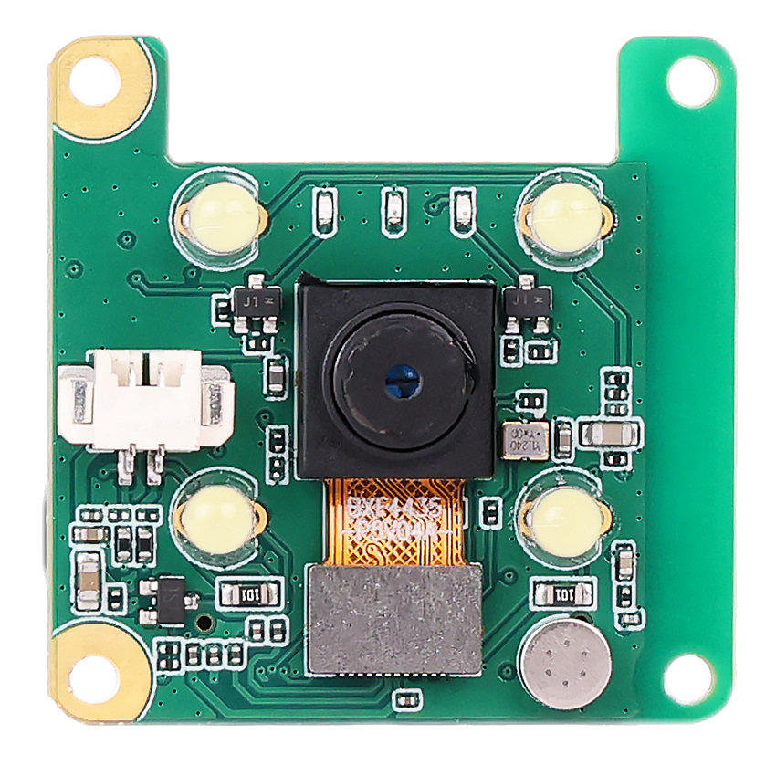  |  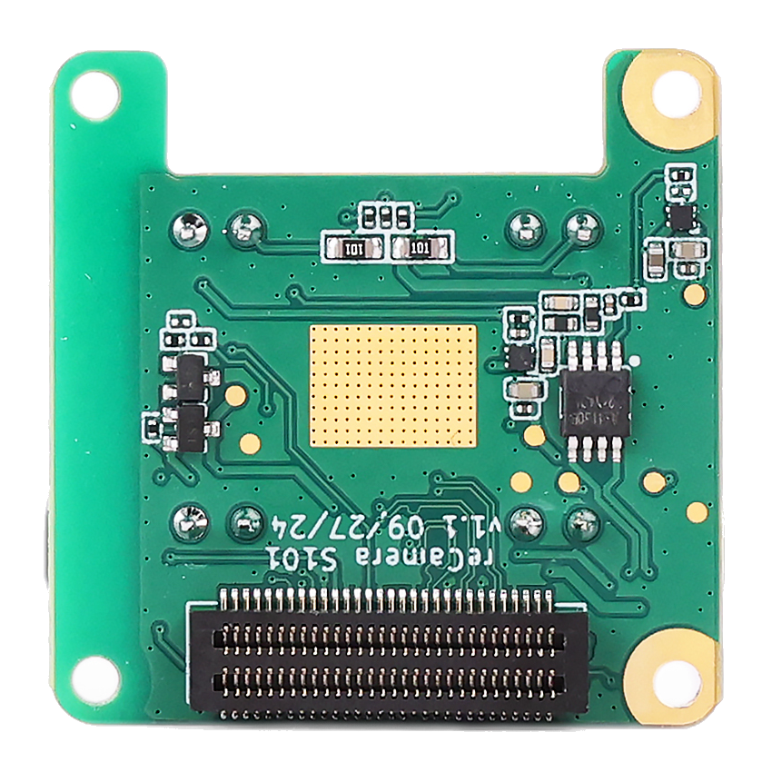

##### ⚙️ Features:

<table ><tbody>
<tr >
    <td style="font-weight: bold;">Sensor</td>
    <td class="dbon">OV5647</td>
    <td style="font-weight: bold;">CMOS Size</td>
    <td class="dbon">1/4 inch</td>
</tr>
<tr >
    <td style="font-weight: bold;">Pixels</td>
    <td class="dbon">5MP</td>
    <td style="font-weight: bold;">Aperture</td>
    <td class="dbon">F2.4</td>
</tr>
<tr >
    <td style="font-weight: bold;">Focal Length</td>
    <td class="dbon">3.89mm</td>
    <td style="font-weight: bold;">Field of View</td>
    <td >72.9°</td>
</tr>
<tr >
    <td style="font-weight: bold;">Distortion</td>
    <td >&lt;1.5%</td>
    <td style="font-weight: bold;">Depth of Field</td>
    <td >20cm ~∞</td>
</tr>
<tr >
    <td style="font-weight: bold;">Image</td>
    <td  colspan="3">2592 x 1944 still picture resolution</td>
</tr>
<tr >
    <td style="font-weight: bold;">Video</td>
    <td  colspan="3">1920 x 1080p @30fps, 1280 x 720p @60fps, 640 x 480p @60fps, 640 x 480p @90fps</td>
</tr>
<tr >
    <td style="font-weight: bold;">Interfaces</td>
    <td  colspan="3">- 4 x LED fill lights  
                    - 1 x microphone 
                    - 1 x speaker 
                    - 3 x LED indicator</td>
</tr></tbody>
</table>

#### 💡 [S2_IMX335](./reCamera_Sensor_Board/S2_IMX335/readme.md)

Top View             |  Bottom View
:-------------------------:|:-------------------------:
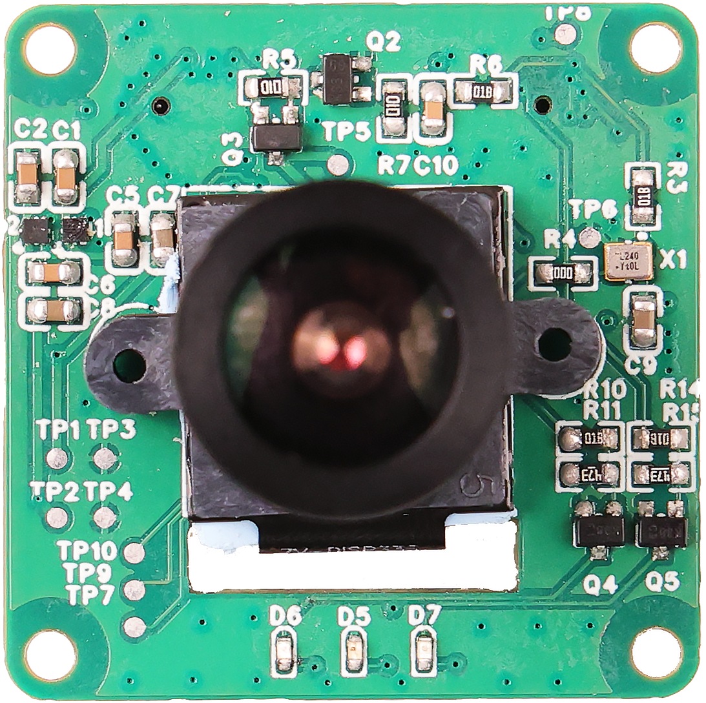  |  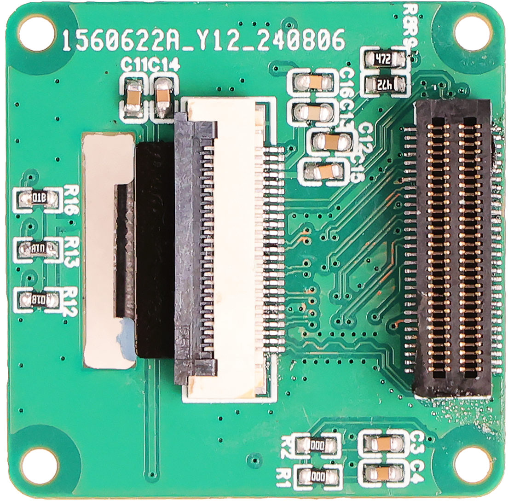

##### ⚙️ Features:

<table ><tbody>
<tr >
    <td style="font-weight: bold;" >Sensor</td>
    <td class="dbon">IMX335</td>
    <td style="font-weight: bold;">CMOS Size</td>
    <td class="dbon">1/2.8 inch</td>
</tr>
<tr >
    <td style="font-weight: bold;">Pixels</td>
    <td class="dbon">5MP</td>
    <td style="font-weight: bold;">Focusing Mode</td>
    <td >manually focusing</td>
</tr>
<tr >
    <td style="font-weight: bold;">Focal Length</td>
    <td class="dbon">3.91mm</td>
    <td style="font-weight: bold;">Field of View</td>
    <td >106°(D) 92.6°(H) 48.6°(V)</td>
</tr>
<tr >
    <td style="font-weight: bold;">Image</td>
    <td  colspan="3">2592 x 1944 still picture resolution</td>
</tr>
<tr >
    <td style="font-weight: bold;">Video</td>
    <td  colspan="3">2592 × 1944p @20fps;1920 × 1080p @30fps;1280 × 720p @30fps</td>
</tr></tbody>
</table>

#### 💡 [S3_SC130GS](./reCamera_Sensor_Board/S3_SC130GS/readme.md)

Top View             |  Bottom View
:-------------------------:|:-------------------------:
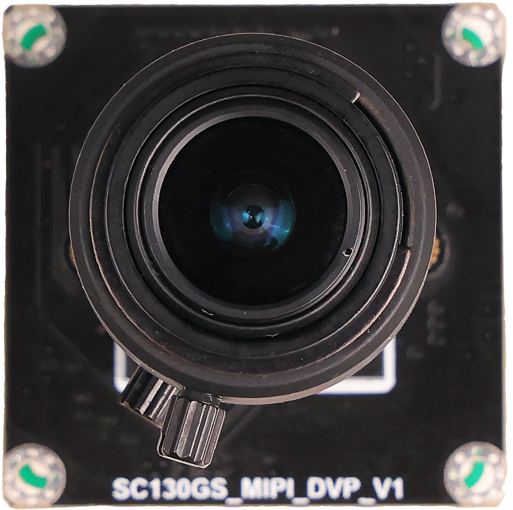  |  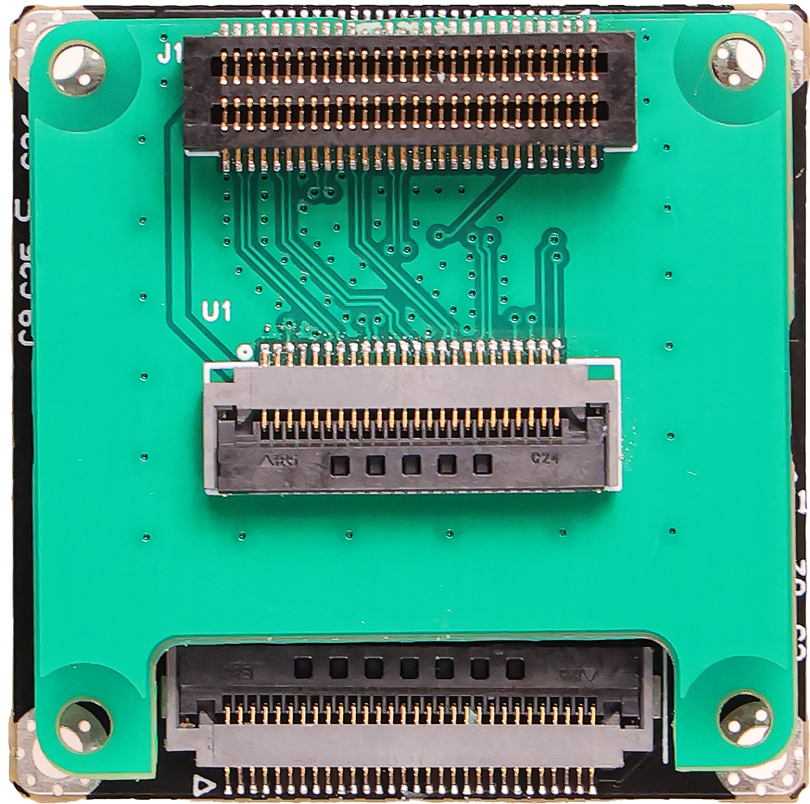

##### ⚙️ Features:

<table ><tbody>
<tr >
    <td style="font-weight: bold;">Sensor</td>
    <td class="dbon">SC130GS</td>
    <td style="font-weight: bold;">CMOS Size</td>
    <td class="dbon">1/2.7 inch</td>
</tr>
<tr >
    <td style="font-weight: bold;">Pixels</td>
    <td class="dbon">1.3MP</td>
    <td style="font-weight: bold;">Output Format</td>
    <td >RAW MONO/RGB</td>
</tr>
<tr >
    <td style="font-weight: bold;">Package</td>
    <td class="dbon">64 pin CLCC</td>
    <td style="font-weight: bold;">Package Size</td>
    <td >13mm x 13mm</td>
</tr>
<tr >
    <td style="font-weight: bold;">Image</td>
    <td  colspan="3"> 1280H x 1024</td>
</tr>
<tr >
    <td style="font-weight: bold;">Video</td>
    <td  colspan="3"> 1280H x 1024 @240fps</td>
</tr></tbody>
</table>

### Base Board

| Board         | Features                           | Version |
| ------------- | ---------------------------------- | ------------ |
| B101_Default    | - Single Port Transformer Module   - SD card reader   - Type-C port   - UART| 1.2 |
| B201_Vertical-mounted Type-C      | - Single Port Transformer Module   - SD card reader   - Type-C port   - UART| 0.1 |
| B301_POE    | - Power over Ethernet(POE)   - UART| 0.1 |
| B401_CAN      | - DC-DC converter   - CAN port   - UART | 0.1 |

#### 💡 [B1_Default](./reCamera_Base_Board/B1_Default/B1_Readme.md)

Top View             |  Bottom View
:-------------------------:|:-------------------------:
  |  

##### ⚙️ Features:

- 1 x Type-C port for power input and communication.
- 1 x Single Port Transformer Module for Ethernet communication support.
- 1 x SD card reader for data storage and exchange.

#### 💡 [B2_Vertical-mounted Type-C](./reCamera_Base_Board/B2_Vertical%20Type-C/B2_Readme.md)

Top View             |  Bottom View
:-------------------------:|:-------------------------:
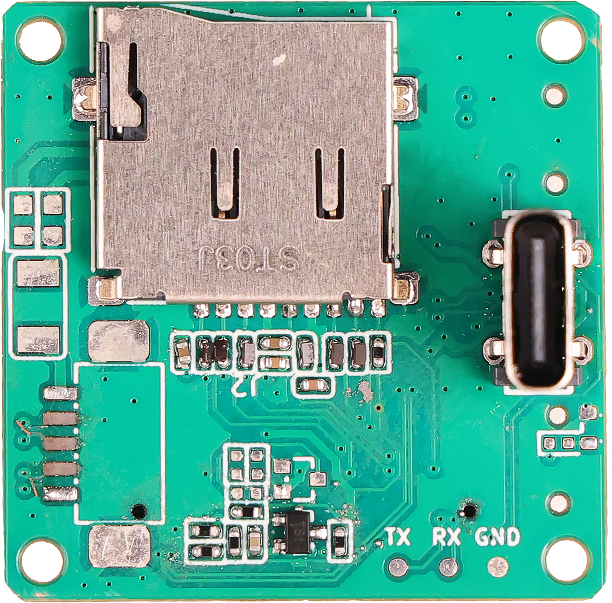  |  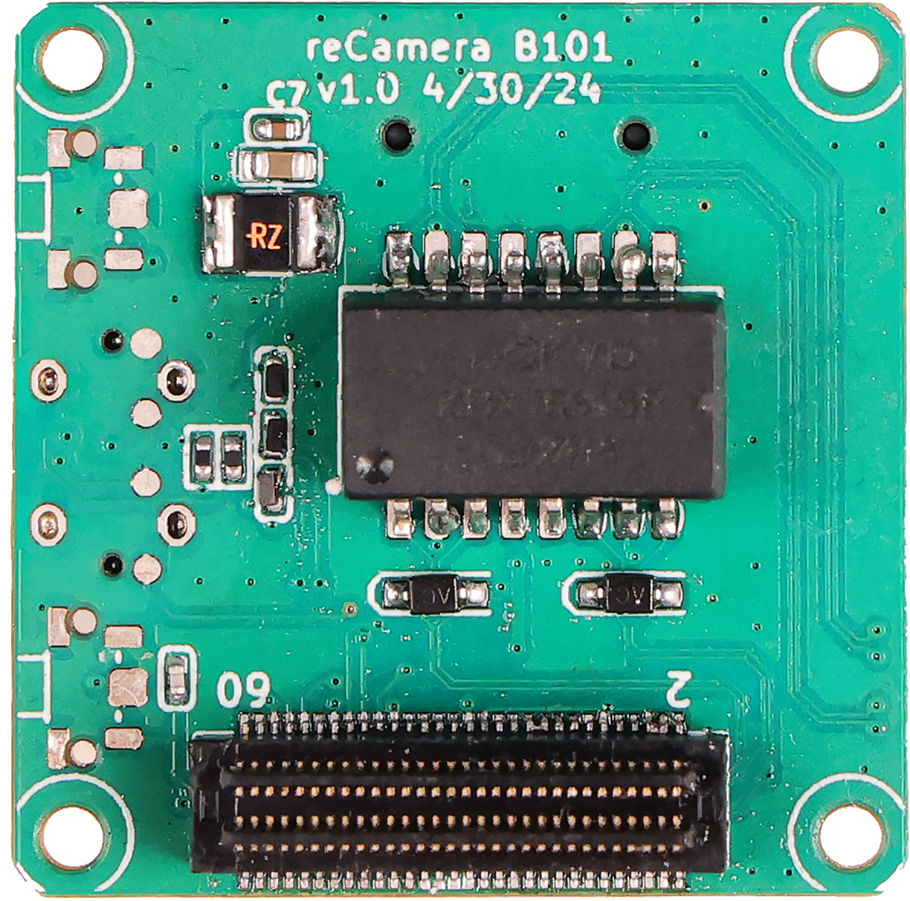

##### ⚙️ Features:

- 1 x Type-C port for power input and communication.
- 1 x Single Port Transformer Module for Ethernet communication support.
- 1 x SD card reader for data storage and exchange.

#### 💡 [B3_POE](./reCamera_Base_Board/B3_POE/B3_Readme.md)

Up             |  Bottom
:-------------------------:|:-------------------------:
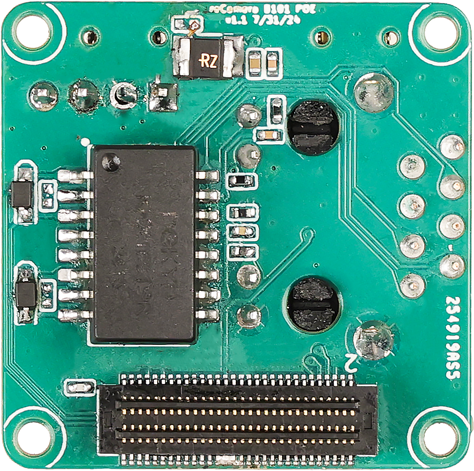  |  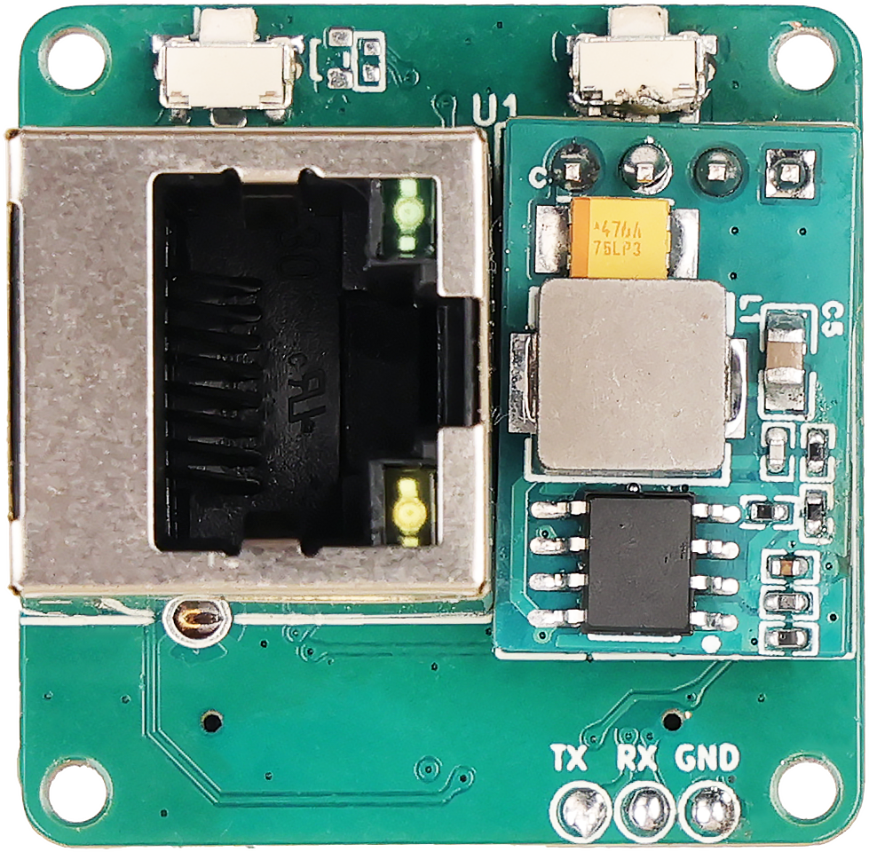

##### ⚙️ Features:

- 1 x RJ45 port for 802.3af PSE.
- 1 x UART port.

#### 💡 [B4_CAN](./reCamera_Base_Board/B4_CAN/B4_Readme.md)

Up             |  Bottom
:-------------------------:|:-------------------------:
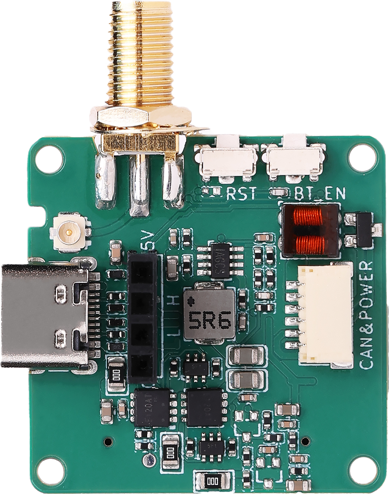  |  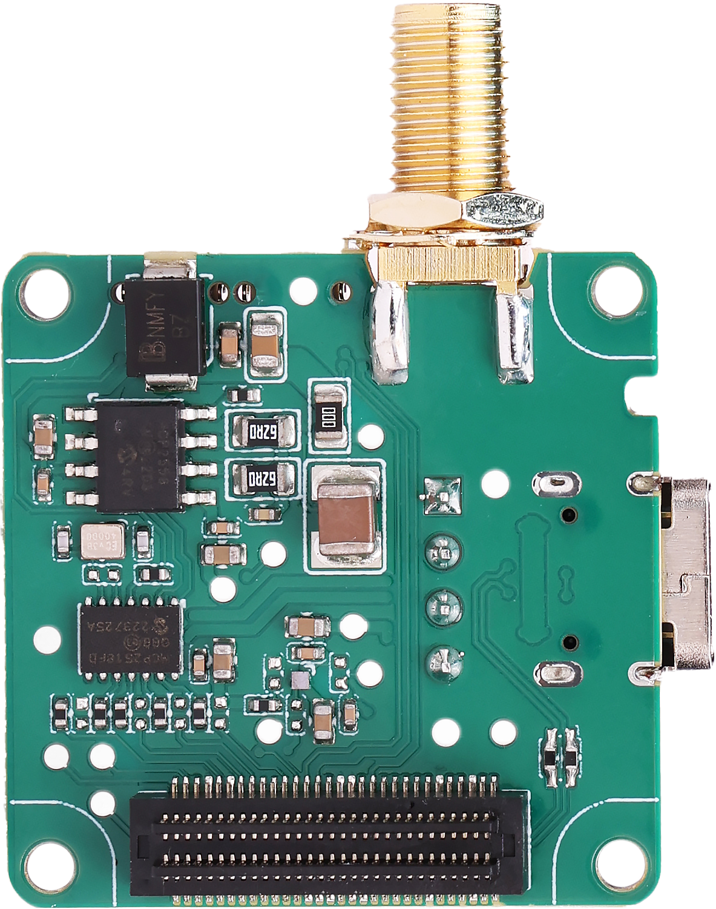

##### ⚙️ Features:

- 1 x CAN port.
- 1 x Gyroscope sensor.
- 1 x UART port.

## reCamera Softwares

The reCamera is a ready-to-use device right after startup. It comes with a stable reCamera OS that supports firmware OTA updates. Additionally, Node-RED and Sensecraft AI platform is integrated in the device for easier deployment experience. This integration offers novice developers a modular programming experience based on Node-RED nodes. For advanced developers, the in-depth Linux-based development and python are also there for twist and play.
We warmly welcome developers proficient in JavaScript, C/C++, Python, Linux OS, buildroot, as well as geeks, students, and beginners, to engage in further development and explore applications.

### [reCamera OS](https://github.com/Seeed-Studio/reCamera-OS)

A Buildroot-based embedded system with integrated services for intelligent camera applications. The reCamera OS update nofitication can be reviewed [here](https://github.com/Seeed-Studio/reCamera-OS/releases/tag/0.1.5).

This is an embedded operating system built on Buildroot, integrating services supervisor, sscma (Seeed SenseCraft Model Assistant), and Node-RED. 
The architecture diagram is shown below
<a href="url">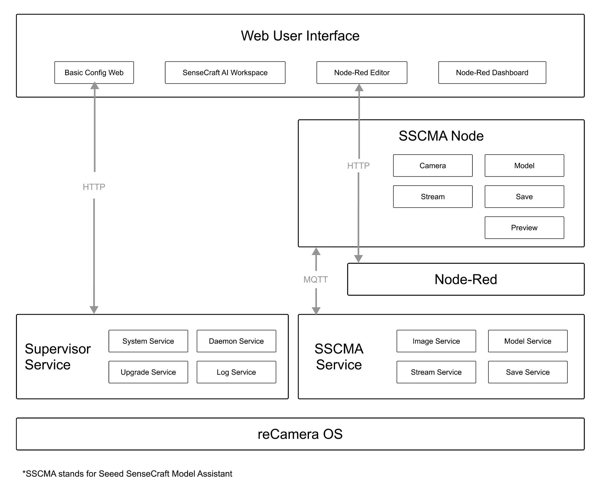</a>

#### 🧩 [Supervisor](https://github.com/Seeed-Studio/sscma-example-sg200x/tree/main/solutions/supervisor)
The foundational system service providing:
- System Services:
    - Device management: Identify and configure connected devices, storage devices, etc.
    - User Management: Manage user accounts, credentials, and SSH keys.
    - Network configuration: Configure wired and wireless network connections.
    - File system operations: Manage device files.
    - Device Discovery: Uses mDNS to broadcast device information. The device hostname is recamera.local.When a web interface sends a request, the recamera device scans the local network for other recamera devices via mDNS, generates a list of discovered devices, formats the data, and returns it to the web interface. (Note: Currently, only one device’s information is returned.)

- Update Service:
    - Package/firmware download management
    - Security verification
    - Installation automation

- Daemon Service:
    - System health monitoring
    - Automatic application recovery

- Logging Service:
    - Runtime status tracking
    - Error diagnostics

- Application Service:
    - Application Deployment
    - Application Packaging

#### 🧩 Node-RED Modules
- [sscma-node (Server-side)](https://github.com/Seeed-Studio/sscma-example-sg200x/tree/main)
    - Image processing service
    - AI model management
    - Media streaming service
    - Data storage service

- [node-red-sscma](https://github.com/Seeed-Studio/node-red-contrib-sscma) 
<a href="url">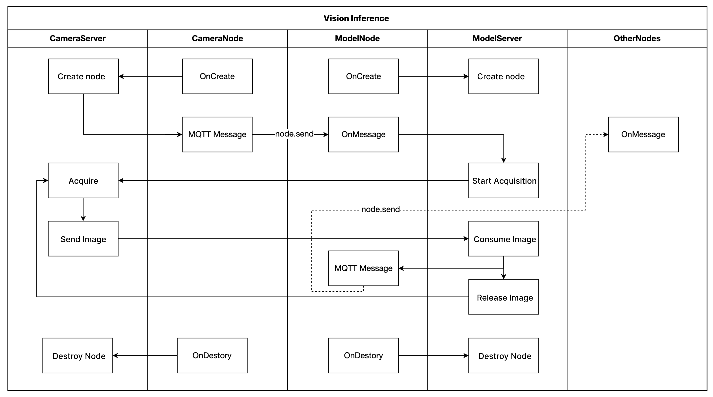</a>

- Prebuilt nodes: Camera, Model, Stream, Save, Preview, Light (More to come...)

If you are not familiar with Node-Red, you can watch this [tutorial](https://www.youtube.com/watch?v=DFNv91TTt68) to learn how to use nodes to achieve different functions and building UI.

### SenseCraft Workspace and [SenseCraft AI](https://sensecraft.seeed.cc/ai/#/home)
- Multi-Application management: Node-Red flow can be stored on SenseCraft Cloud Service. Super easy one click to deploy different application on the device.
<a href="url">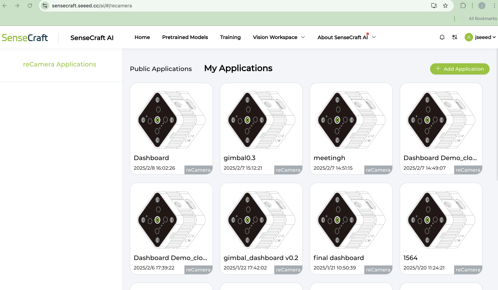</a>

## Related Projects

### reCamera Gimbal-Coming Soon

Effortlessly transform your gimbal with AI-powered control by connecting this camera module. Gain precise, two-axis movement—up, down, left, right—without any coding to start. Using the intuitive Node-RED platform, you can easily integrate and fine-tune the system, allowing computer vision via YOLO v11 to enhance your gimbal's tracking capabilities. Just set up your preferred model in Node-RED, make a few adjustments, and experience the full potential of computer vision in your gimbal.

### reCamera Industrial-Work in progress

We are excited to announce that the reCamera Industrial is working in progress! This version will feature EVS cameras and infrared thermal camera modules, providing enhanced capabilities for industrial applications.

We are also working on compatibility with Neurala, a software that helps manufacturers automate visual quality inspection and control processes with vision AI. This integration will enable reCamera Industrial to offer advanced visual inspection and control features, making it an ideal solution for industrial scenarios.

Stay tuned for the release of reCamera Industrial and experience the power of vision AI in industrial applications.

### reCamera Robot Arm-work in progress

Enhance your robotic arm’s capabilities with seamless AI integration through this advanced camera module. Featuring flexible interface expansion and the open-source reCamera OS, this module adds powerful computer vision to your robotics setup for precise control and intelligent object recognition. Tailor it to your specific needs, and let the versatile interface handle complex tasks with advanced vision and adaptability.

## 🧱 Application Demo
The reCamera offers a wide range of application demos, demonstrating its versatility and potential in various fields. Here are some of the application demos which we are working in progress:

### Web Interface Example: Dashboard
| Dashboard     | Support Devices                 | Version |
| ------------- | ---------------------------------- |---------------------------------- |
| [reCamera Dashboard](./Dashboard/readme.md) | reCamera 2002(w) 8GB/64GB | V1.0|
| reCamera Gimbal Dashboard(coming soon) | reCamera Gimbal |V1.0|

Node-Red dashboard2 Palette supports UI nodes to build a dashboard. With this integrated ability, You can change the Dashboard to any way of interactions at any time in node-red to customize the functionality of this stand-alone device. [Preview Link](https://youtu.be/8inW10l_-wo)

<a href="url">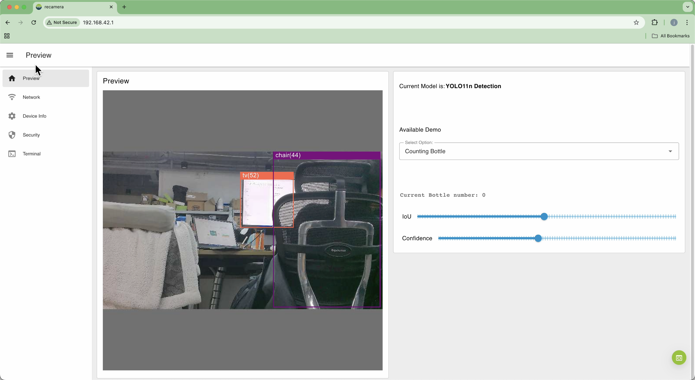</a>

### Email Notification with Detection Frame
- When a target is detected, an email containing the detection frame is sent. 

### Sound Playback upon Target Detection
- When a target is detected, a sound is played. 

### Home Assistant Integration
- The reCamera can be integrated with Home Assistant, enabling seamless control and automation within a smart home environment.

### IP Camera Functionality
- Multiple cameras can be used to transmit data.
- Data is automatically deleted after storage.

### Nighttime Detection with Timed Light Activation
- Lights are turned on at night for detection purposes.

### Arduino Integration
- When a specific condition is detected, the Arduino executes a corresponding action using MQTT.

### Posture Detection
- The reCamera can be used for posture detection, enabling applications such as fitness tracking and ergonomic analysis.

### Gesture Detection
- The reCamera can be used for gesture detection, enabling intuitive user interfaces and interaction.

### Low Power Consumption
- (Pending camera node modification)

### Local Storage of Video Stream/Photos upon Target Detection
- When a target is detected, the video stream or photos are stored locally using the save node. 

These application demos showcase the capabilities of the reCamera and provide a starting point for further development and customization.

## reCamera Roadmap

If you have suggestions for improvements or bugs in the current system, please file an **Issue**. It will help us get feedback on the user experience and advancing project iterations.

### 💡Software

| Firmware Version | Description                                                  | Iterative version |
| ---------------- | ------------------------------------------------------------ | ----------------- |
| 0.1.4            | The node-red save node passes a parameter to save the video stream. | 0.1.5             |
| 0.1.4            | Node-red recamera nodes reference enabled camera on and off  | WIP..             |
| 0.1.4            | The Node that adds CAN_Send, CAN_Receive, and CAN_Config for Gimbal | 0.1.6             |
| 0.1.4            | Add the Gimbal Dashboard Application                         | 0.1.6             |

### 💡Hardware

| Board                   |Board Type   | Description                                              | Date    |
| ------------------------ |----------- | -------------------------------------------------------- | ------- |
| B401_CAN                   |Base Board| A base plate that provides a CAN communication interface | 2025/02 |
| S201_imx335               |Sensor Board  | cmos = 1/2.8 inch sensor module                          | 2025/04 |
| S301_SC130GS              |Sensor Board  | A 100W pixel global shutter camera                       | 2025/04 |
| S401_GENX320              |Sensor Board  | 320x320 Pixel EVS (Event-based Vision Sensor)                       | 2025/04 |
| B201_Vertical Type-C      |Base Board | type-c back base plate                                   | 2025/04 |
| B301_POE                  |Base Board | POE powered baseboard                                    | 2025/04 |
| S_Thermal imaging camera|Sensor Board | Industrial thermal imaging camera                        | WIP..   |
| B_Thermal imaging screen |Sensor Board | Use with thermal imaging camera                          | WIP..   |

