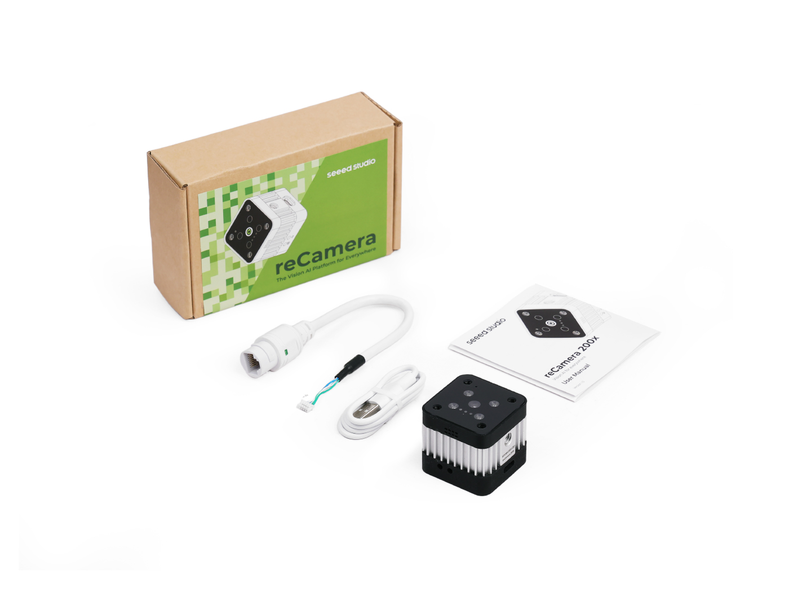

# Seeed Studio reCamera Hardware

English | [简体中文](README-CN.md)

This repository is the hardware documentation and design-resource hub for two
generations of Seeed Studio reCamera:

- **reCamera 2002 / 2002w** (SG2002), the first-generation modular platform.
- **reCamera Pro** (RV1126B), the second-generation higher-performance platform.

The generation labels describe this repository's organization. Product names
and currently sold configurations follow Seeed Studio's official pages.

## Product generations

| | First generation | Second generation |
| --- | --- | --- |
| Product family | reCamera 2002 / 2002w | reCamera Pro |
| Processor | Sophgo SG2002 | Rockchip RV1126B |
| CPU | Dual C906 RISC-V cores | Quad-core Cortex-A53 at 1.2GHz |
| AI acceleration | 1 TOPS INT8 | 3 TOPS NPU |
| Memory | 256MB | 2GB / 4GB LPDDR4 |
| Standard camera | OV5647, 5MP | SC850SL, 8MP, 4K at 30fps |
| Hardware model | Interchangeable core, sensor, and base boards | Integrated camera with expansion interfaces |
| Documentation | [reCamera 2002 hardware](hardware/recamera-2002/) | [reCamera Pro hardware](hardware/recamera-pro/) |

### reCamera 2002 / 2002w



The repository contains editable KiCad sources, schematic PDFs, mechanical
files, and revision notes for the C1 core, S-series sensor boards, and B-series
base boards.

### reCamera Pro

[](https://www.seeedstudio.com/reCamera-Pro-2GB.html)

[Buy reCamera Pro 2GB from Seeed Studio](https://www.seeedstudio.com/reCamera-Pro-2GB.html)

The repository currently provides an official-specification snapshot, polished
storefront product images, and technical interface images for reCamera Pro. Editable Pro PCB and
mechanical source files should be added only when an approved hardware release
is available.

## Repository layout

```text
.
|-- hardware/
|   |-- recamera-2002/       # First-generation board and mechanical sources
|   `-- recamera-pro/        # Second-generation specification and images
|-- docs/                    # Official sources and maintenance policy
|-- .github/workflows/       # Repository administration
|-- CONTRIBUTING.md
`-- LICENSE
```

## Scope

This is a **hardware-only repository**. Firmware, application code, Node-RED
flows, AI models, training data, demos, and SDK examples are intentionally not
stored here. Use the official [reCamera documentation](https://wiki.seeedstudio.com/recamera/)
and Seeed Studio software repositories for those resources.

Gimbal, Microscope, and other finished-product derivatives are not separate
hardware generations in this repository. Shared reCamera 2002 modules remain
documented under the first-generation platform.

## Source of truth

Hardware summaries are reviewed against official Seeed Studio product and Wiki
pages. See [docs/OFFICIAL_SOURCES.md](docs/OFFICIAL_SOURCES.md) for the source
list and review date. A currently shipped product page takes precedence over a
repository snapshot when specifications or available configurations change.

Contributions must follow [CONTRIBUTING.md](CONTRIBUTING.md). Unless a file says
otherwise, repository content is provided under the [Apache License 2.0](LICENSE).
